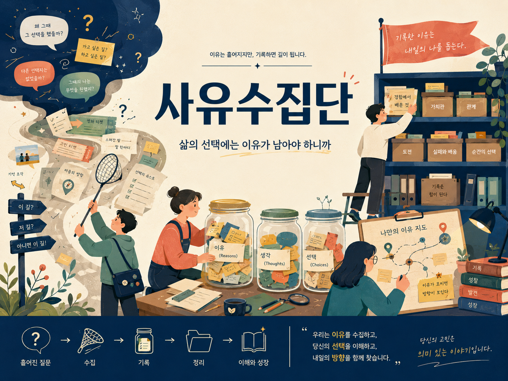

<!-- TODO: banner.png 를 이 폴더(profile/)에 추가한 뒤 아래 두 줄의 주석을 해제하세요.
     Add banner.png to this folder, then uncomment the block below.

  

-->

# 사유수집단 · Reason Collectors

**우리는 이유를 수집하고, 당신의 선택을 이해하고, 내일의 방향을 함께 찾습니다.** 
*We collect reasons, understand your choices, and find tomorrow's direction — together.*

---

## 왜 · Why

선택의 순간이 지나면 결과만 남고, **왜 그렇게 했는지**는 사라집니다.
"왜 그때 그 선택을 했을까?" — 그 질문에 답할 근거가 우리에겐 거의 남아 있지 않습니다.

이유는 흩어지지만, 기록하면 길이 됩니다.
사유수집단은 흩어지는 그 '왜'를 붙잡아 두는 도구를 만듭니다.

> After a decision passes, only the outcome remains — **the reasoning behind it disappears.**
> "Why did I choose that, back then?" We rarely keep the evidence to answer it.
>
> Reasons scatter, but once recorded they become a path.
> Reason Collectors builds tools that hold on to that *why*.

## 무엇을 · What we do

| 단계 | Step | 하는 일 |
|---|---|---|
| 흩어진 질문 | Scattered questions | 결정 앞에서 떠오르는 고민을 있는 그대로 붙잡습니다 |
| 수집 | Collect | 이유·생각·선택을 한곳에 모읍니다 |
| 기록 | Record | 판단의 근거를 그 순간의 맥락과 함께 남깁니다 |
| 정리 | Organize | 쌓인 기록을 가치관·관계·도전 같은 축으로 엮습니다 |
| 이해와 성장 | Understand & grow | 나만의 '이유 지도'를 보고 다음 방향을 정합니다 |

**이유가 모이면 방향이 보입니다.** · *When reasons gather, direction appears.*

## 프로젝트 · Projects

### 고민로그 · Gomin Log — 첫 번째 플랫폼 · Our first platform

지나가면 흐려지는 상황의 맥락을 **가볍게** 남기고, **하루 안에** "왜 그랬는지"를 정리하는 앱.
물건 구매만이 아니라 **대화 · 관계 · 업무 · 감정 · 일정**까지 — 사소해서 기록하지 않던 순간들을 다룹니다.

> An app to jot down the context of moments that blur once they pass — **lightly** —
> and to make sense of *"why did I do that?"* **within the same day.**
> Not just purchases, but **conversations, relationships, work, emotions, and schedules** —
> the moments too small to have ever been written down.

| | |
|---|---|
| 남기는 것 · What you log | 그 순간의 상황과 마음 — 한두 줄이면 충분 |
| 정리하는 때 · When you review | 기억이 살아 있는 **하루 안에** |
| 남는 것 · What you get | 되돌아볼 수 있는 나만의 이유 기록 |

| Repository | 설명 · Description | 상태 · Status |
|---|---|---|
| — | 고민로그 · Gomin Log | 🚧 개발 중 · In development |

<!-- 저장소를 공개하면 위 표의 `—`를 링크로 바꾸세요 · replace `—` with a repo link once public
     예시: | [gomin-log](https://github.com/Reason-Collectors/gomin-log) | 고민로그 · Gomin Log | 🚧 개발 중 · In development |
-->

## 원칙 · Principles

**1. 결론보다 근거 · Evidence over conclusions**
무엇을 골랐는지보다 왜 골랐는지를 남깁니다.
*We record the reasoning, not just the pick.*

**2. 판단하지 않고 이해하기 · Understand, don't judge**
지난 선택을 평가하는 대신 그때의 맥락을 복원합니다.
*Instead of grading past choices, we restore the context they were made in.*

**3. 기록은 힘이 된다 · Records become leverage**
기록한 이유는 내일의 나를 돕습니다.
*The reasons you write down help the person you'll be tomorrow.*

## 함께하기 · Join us

지금은 **1인 팀**으로 움직입니다. 프로젝트가 자리를 잡고 수익이 만들어지는 만큼,
같은 질문에 관심 있는 사람을 한 명씩 초대해 함께 만들어 갈 계획입니다.

> Currently a **one-person team**. As the project finds its footing and starts to earn,
> I plan to invite people who care about the same questions — one at a time.

관심이 있다면 Issues나 Discussions에 흔적을 남겨 주세요.
*If that sounds like you, leave a trace in Issues or Discussions.*

## 연락 · Contact

- GitHub · [@unseoJang](https://github.com/unseoJang)
- Email · <!-- 공개할 주소를 넣으세요 · add a public address -->

---

**당신의 고민은 의미 있는 이야기입니다.** 
*Your deliberation is a story worth keeping.*

